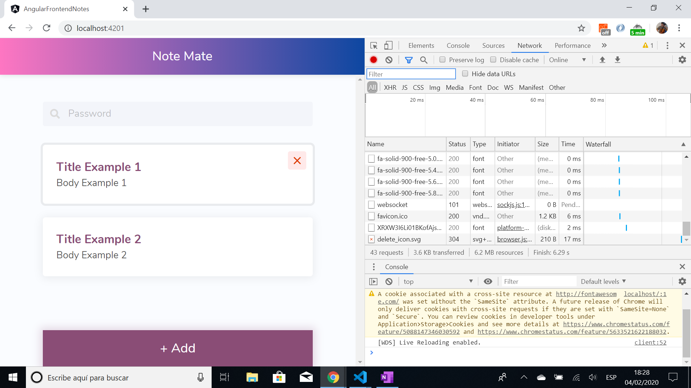

# Angular Frontend Notes

* Angular 8 tutorial app to allow user to add notes to a notes list. Notes can be viewed and deleted from this list. Includes a filter so user can search for key words and filtered results will order themselves in terms of relevancy.

* Clicking on a note navigates to that note where the note can be edited.

* All code by [Devstackr](https://www.youtube.com/channel/UCbwsS1m4Hib6R-9F1alus_A/featured) from Youtube [tutorial series]([Project Demo & Introduction - [1] Build a Notes App w/ Angular](https://www.youtube.com/watch?v=dlXEeOk-MrI&t=7s)).

## Table of contents

* [General info](#general-info)
* [Screenshots](#screenshots)
* [Technologies](#technologies)
* [Setup](#setup)
* [Features](#features)
* [Status](#status)
* [Inspiration](#inspiration)
* [Contact](#contact)

## General info

* 5 part Youtube tutorial series. 

## Screenshots




## Technologies

* [Angular v8.2.14](https://angular.io/)
* [Bulma v0.8.0](https://bulma.io/documentation/) CSS framework
* [Font Awesome v5.12.0](https://fontawesome.com/) icons
* [rxjs v6.4.0](https://angular.io/guide/rx-library) reactive programming library

## Setup

* To start the server on _localhost://4200_ type: 'ng serve'

## Code Examples

* on initialisation of `note-details.component.ts` check if note is new

```typescript
ngOnInit() {
  // new note or editing existing one?
  this.route.params.subscribe((params: Params) => {
    this.note = new Note();
    if (params.id) {
      this.note = this.notesService.get(params.id);
      this.noteId = params.id;
      this.new = false;
    } else {
      this.new = true;
    }
  })
}
```

## Features

* Bulma CSS styles used for the first time.

## Status & To-do list

* Status: Video 5 of 5 completed - frontend only so far. Backend to be added later.

* To-do: Fix `issue with TypeError: Cannot read property 'nativeElement' of undefined`. complete tutorial.

## Inspiration

* [Project Demo & Introduction - [1] Build a Notes App w/ Angular](https://www.youtube.com/watch?v=dlXEeOk-MrI&t=7s)
* [Creating the UI (Angular) - [2] Build a Notes App w/ Angular](https://www.youtube.com/watch?v=akUcKvEsG8w)
* [Creating the Note Details Page - [3] Build a Notes App w/ Angular](https://www.youtube.com/watch?v=Rghqrp59XJA)
* [Adding Animations to Note Cards | Angular Animations - [4] Build a Notes App w/ Angular](https://www.youtube.com/watch?v=0DnL5awucWE)
* [Searching Notes - [5] Build a Notes App w/ Angular](https://www.youtube.com/watch?v=vWt9WvjUfRA)

* [Devstackr: Github repo](https://github.com/Devstackr/basic-notes-app-mean-stack)
* [Maya Shavin: Medium article: ES6 — Set vs Array — What and when?](https://medium.com/front-end-weekly/es6-set-vs-array-what-and-when-efc055655e1a)

## Contact

Repo created by [ABateman](https://www.andrewbateman.org) - feel free to contact me!